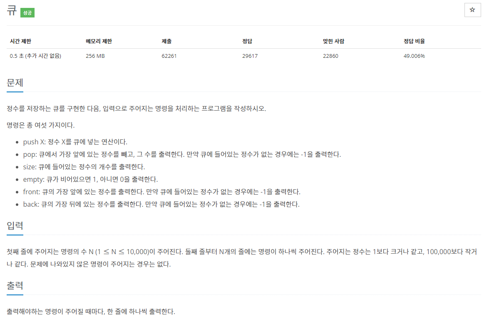
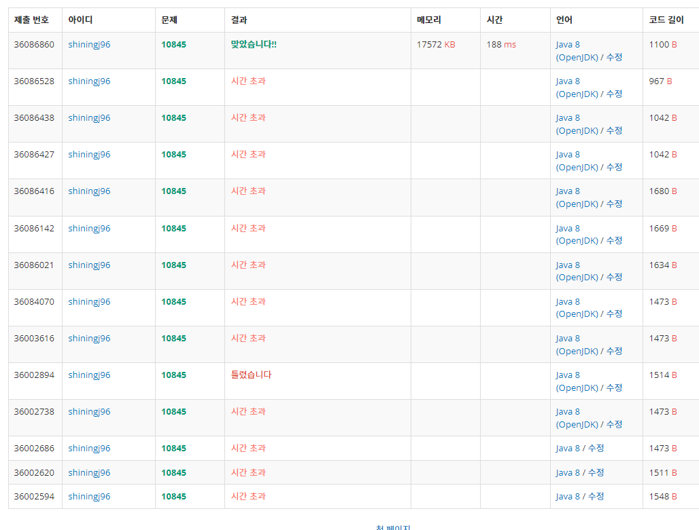

# 큐 - 10845

## 피드백

우선, 밑의 결과를 보자.

시간초과때문에 상당히 애먹었다...

내가 사용한 코드와 솔루션 코드를 비교하여 피드백을 진행해보자.

## 내가 사용한 코드 (시간초과)

    import java.util.Scanner;
    import java.util.LinkedList;

    public class Main {
        public static void main(String[] args) {
            Scanner sc = new Scanner(System.in);
            int n = sc.nextInt();
            LinkedList<Integer> queue = new LinkedList<>();
            for (int k=0; k<n; k++) {
                String cmd = sc.next();
                switch (cmd) {
                    case "push":
                        int num = Integer.parseInt(sc.next());
                        queue.add(num);
                        break;

                    case "pop":
                        if (queue.isEmpty()) {
                            System.out.println("-1");
                        } else {
                            System.out.println(queue.removeFirst());
                        }
                        break;

                    case "front":
                        if (queue.isEmpty()) {
                            System.out.println("-1");
                        } else {
                            System.out.println(queue.getFirst());
                        }
                        break;
                    case "size":
                        System.out.println(queue.size());
                        break;
                    case "empty":
                        if (queue.isEmpty()) {
                            System.out.println("1");
                        } else {
                            System.out.println("0");
                        }
                        break;
                    case "back":
                        if (queue.isEmpty()) {
                            System.out.println("-1");
                        } else {
                            System.out.println(queue.getLast());
                        }
                        break;
                }
            }
        }
    }

## 솔루션

    import java.util.*;
    import java.io.*;

    class Main {
        public static void main(String args[]) throws IOException {
            BufferedReader br = new BufferedReader(new InputStreamReader(System.in));
            int N = Integer.parseInt(br.readLine());
            StringTokenizer st;
            StringBuilder sb = new StringBuilder();
            Queue<Integer> queue = new LinkedList<Integer>();
            int back = -1;
            for(int i = 0 ; i < N ; i ++) {
                st = new StringTokenizer(br.readLine());
                String type = st.nextToken();
                switch(type) {
                case "push":
                    back = Integer.parseInt(st.nextToken());
                    queue.offer(back);	
                    break;
                case "pop":
                    if(queue.isEmpty()) {
                        sb.append("-1").append("\n");
                        break;
                    }
                    sb.append(queue.poll()).append("\n");
                    break;
                case "size":
                    sb.append(queue.size()).append("\n");
                    break;
                case "empty":
                    sb.append(queue.isEmpty()? 1: 0).append("\n");
                    break;
                case "front":
                    sb.append(queue.isEmpty()? -1: queue.peek()).append("\n");
                    break;
                case "back":
                    sb.append(queue.isEmpty()? -1: back).append("\n");
                    break;
                    
                }
            }
            System.out.print(sb);
        }
    }

## 새로 배운것

1. 솔루션을 보면 StringBuillder 클래스에서 append 메서드를 사용해 한번에 출력했음을 알 수 있다. 시간제한이 0.5초일 경우 반복문을 통해 하나하나 출력하는 것보다 sb클래스를 통해 한번에 출력하는것이 더 빠른것을 알 수 있었다.

2. BufferedReader, StringTokenizer, StringBuilder 클래스를 사용하는것이 익숙하지 않다. 빠르게 학습하자.

## 다시 만들어본 나의 코드

    import java.util.*;
    import java.io.*;

    public class Main {
        public static void main(String[] args) throws IOException {
            BufferedReader br = new BufferedReader(new InputStreamReader(System.in));
            int n = Integer.parseInt(br.readLine());
            StringTokenizer st;
            StringBuilder sb = new StringBuilder();
            Queue<Integer> queue = new LinkedList<>();
            int end = 0;

            while(n-- > 0) {
                st = new StringTokenizer(br.readLine());
                String cmd = st.nextToken();
                switch (cmd) {
                    case "push":
                        end = Integer.parseInt(st.nextToken());
                        queue.offer(end);
                        break;
                    case "pop" :
                        if (queue.isEmpty()) {
                            sb.append("-1").append("\n");
                            break;
                    }
                        sb.append(queue.poll()).append("\n");
                        break;
                    case "size" :
                        sb.append(queue.size()).append("\n");
                        break;
                    case "empty" :
                        if (queue.isEmpty()) {
                            sb.append("1").append("\n");
                            break;
                        }
                        sb.append("0").append("\n");
                        break;
                    case "front" :
                        if (queue.isEmpty()) {
                            sb.append("-1").append("\n");
                            break;
                        }
                        sb.append(queue.peek()).append("\n");
                        break;
                    case "back" :
                        if (queue.isEmpty()) {
                            sb.append("-1").append("\n");
                            break;
                        }
                        sb.append(end).append("\n");
                        break;
                }
            }
            System.out.print(sb);
        }
    }