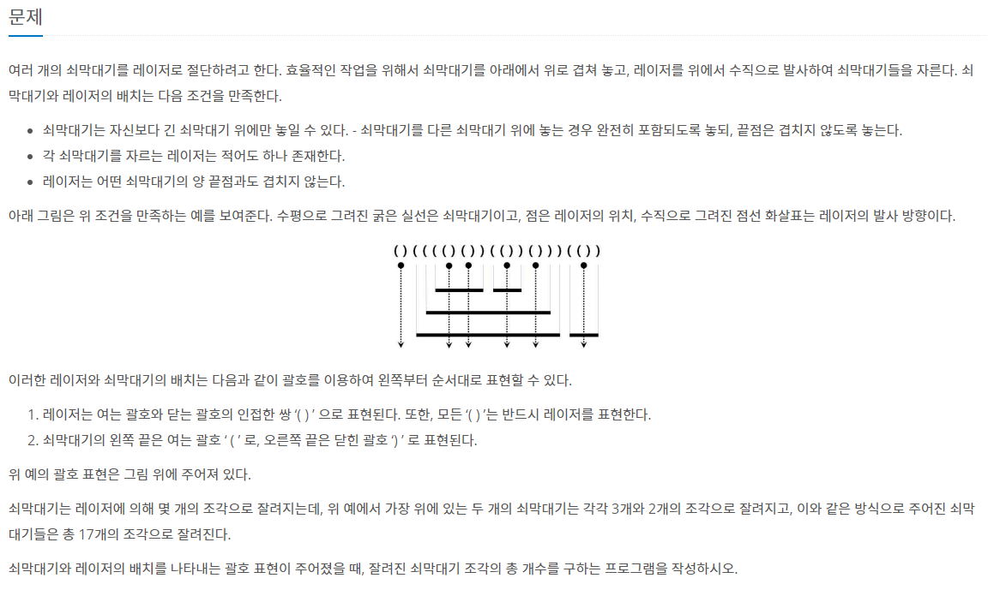
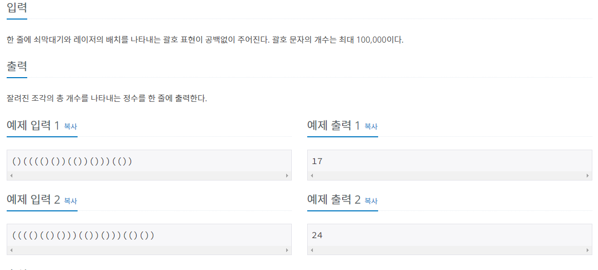
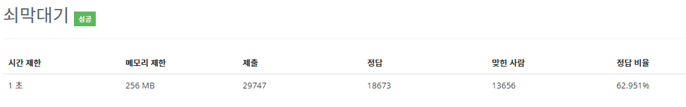

# 쇠막대기 - 10799

## 문제

##  풀이

- 시간복잡도 : O(n) = 100,000
- 시간제한 : 1초

1. 이 문제는 ')'가 처음 나왔을 경우를 기준으로 생각하자. (쇠막대기 이전 레이저 제외)
2. 그전까지 '(' 가 계속 나올 것이다. 이는 쇠막대기의 갯수와 일치한다.
3. ')'가 나오기 전 까지 스택 자료구조에 '('의 인덱스를 넣는다.
4. ')'를 만나면 스택 자료구조에 들어간 인덱스와 비교하자. peek + 1 과 i가 같을 경우 이는 레이저다. 스택 자료구조의 사이즈만큼 ans에 + 해주자.
5. peek + 1과 i가 같지 않을 경우 이는 쇠막대기의 끝이다. +1을 해주자.
6. ans를 출력하자.

