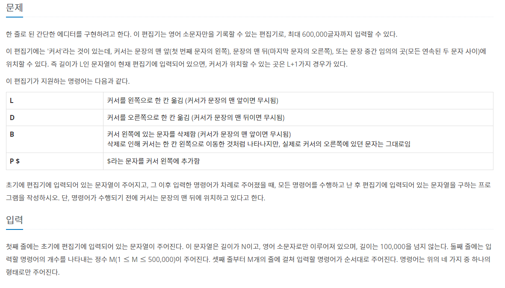
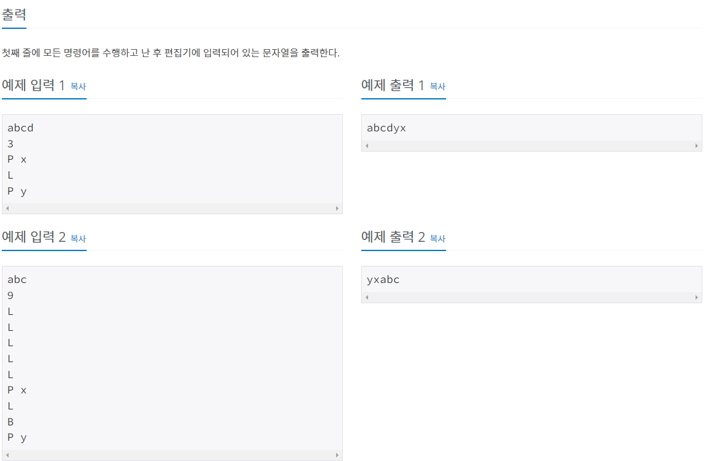

# 에디터 - 1406

---

풀이방법 :

1. StringBuffer 사용

2. Stack 자료구조 이용

3. linkedList 사용

시간복잡도 :

1. StringBuffer의 경우 O(n^2)

2. Stack 자료구조의 경우 : O(n)

3. LinkedList의 경우 : 아직 모름

## 풀면서 느낀 것

알고리즘 문제를 풀며 자바의 사용법에 익숙해져가는 중이다. 스택자료구조의 사용 말고 LinkedList를 사용하는 법을 통해 문제를 해결해봐야겠다.
