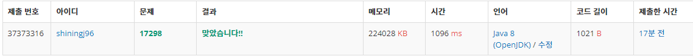

# 오큰수 - 17298 

## 문제

크기가 N인 수열 A = A1, A2, ..., AN이 있다. 수열의 각 원소 Ai에 대해서 오큰수 NGE(i)를 구하려고 한다. Ai의 오큰수는 오른쪽에 있으면서 Ai보다 큰 수 중에서 가장 왼쪽에 있는 수를 의미한다. 그러한 수가 없는 경우에 오큰수는 -1이다.

예를 들어, A = [3, 5, 2, 7]인 경우 NGE(1) = 5, NGE(2) = 7, NGE(3) = 7, NGE(4) = -1이다. A = [9, 5, 4, 8]인 경우에는 NGE(1) = -1, NGE(2) = 8, NGE(3) = 8, NGE(4) = -1이다.

## 입력

첫째 줄에 수열 A의 크기 N (1 ≤ N ≤ 1,000,000)이 주어진다. 둘째 줄에 수열 A의 원소 A1, A2, ..., AN (1 ≤ Ai ≤ 1,000,000)이 주어진다.

## 출력

총 N개의 수 NGE(1), NGE(2), ..., NGE(N)을 공백으로 구분해 출력한다.

## 문제 풀이

시간 복잡도 : O(n) = 1,000,000

1. 이 문제에서 스택 자료구조의 의미: 오큰수를 찾지 못한 수열a의 인덱스
2. 수열 a의 크기만큼의 배열 a[] 생성
3. 오큰수를 담을 배열 nge[] 생성
4. a[0]을 스택에 담는다.
5. 이때부터 for문을 이용하여 스택에 담겨있는 인덱스번째의 a[stack.peek]과 a[i]를 비교한다.
6. 주의할 점은 중간에 있는 숫자가 여럿일 수 있기에 if가 아닌 while을 써야한다.
7. 마지막으로 아직 스택이 비어있지 않을 경우 오큰수가 없는 수이다. -1을 넣자.
8. 출력해야할것이 많으므로 BufferedWriter을 사용하자.

