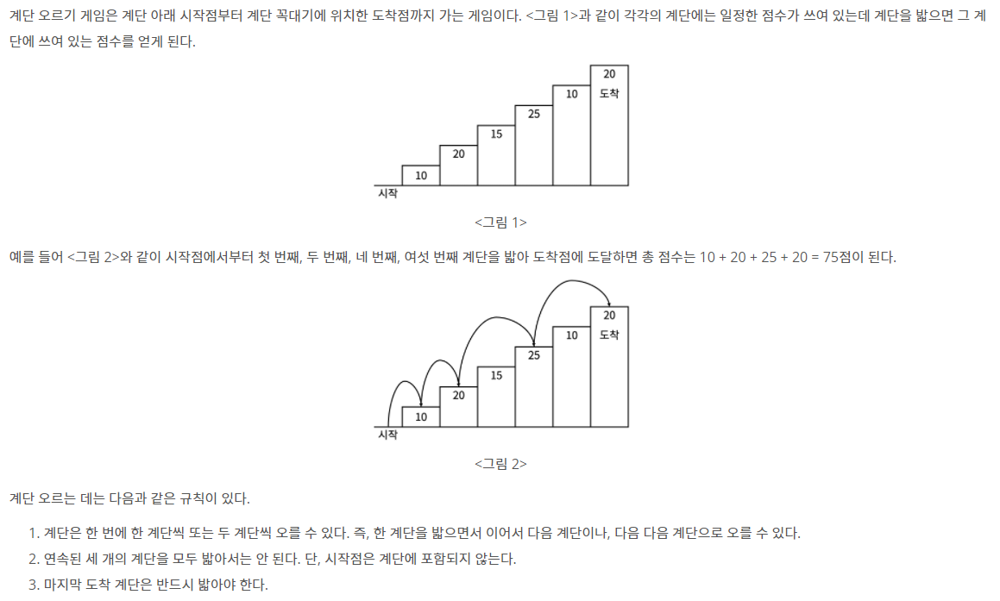
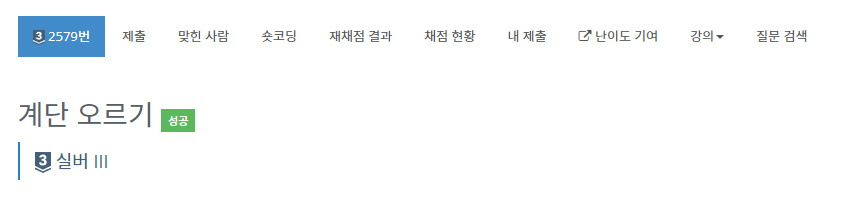
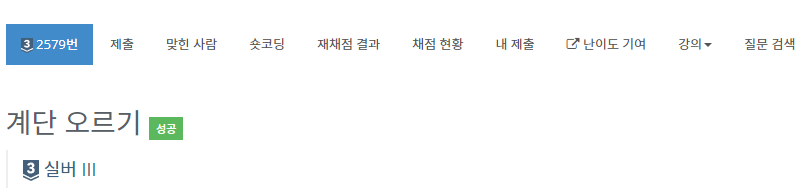

# 계단 오르기 -2579

## 문제

따라서 첫 번째 계단을 밟고 이어 두 번째 계단이나, 세 번째 계단으로 오를 수 있다. 하지만, 첫 번째 계단을 밟고 이어 네 번째 계단으로 올라가거나, 첫 번째, 두 번째, 세 번째 계단을 연속해서 모두 밟을 수는 없다.

각 계단에 쓰여 있는 점수가 주어질 때 이 게임에서 얻을 수 있는 총 점수의 최댓값을 구하는 프로그램을 작성하시오.

## 입력

입력의 첫째 줄에 계단의 개수가 주어진다.

둘째 줄부터 한 줄에 하나씩 제일 아래에 놓인 계단부터 순서대로 각 계단에 쓰여 있는 점수가 주어진다. 계단의 개수는 300이하의 자연수이고, 계단에 쓰여 있는 점수는 10,000이하의 자연수이다.

## 출력

첫째 줄에 계단 오르기 게임에서 얻을 수 있는 총 점수의 최댓값을 출력한다.

## 문제 풀이

### 1. 테이블 정의

`D[i] = i번째 계단까지 오를 때 점수 합의 최대값을 구하기` = 틀림

계단을 연속해서 밟을 수 있다는 조건이 있기 때문.

`D[i][j] = j개의 계단을 연속해서 밟고 i번째 계단까지 오를 때 점수 합의 최대값을 구하기. 이 때 i번째 계단은 반드시 밟아야 함.`

여기서 j의 값은 항상 1 or 2

### 2. 점화식

- j가 1일 경우
  - D[k][1] = max(D[k-2][1], D[k-2][2]) + S[k]
- j가 2일 경우
  - D[k][2] = D[k-1][1] + S[k]

### 3. 초기값

- D[1][1] = S[1]
- D[1][2] = 0
- D[2][1] = S[2]
- D[2][2] = S[1] + S[2]

## 문제풀이 2

### 1. 테이블 정의

`D[i] = i번째 계단까지 올라섰을 때 밟지 않을 계단의 합의 최솟값. 단, i번째 계단은 반드시 밟지 않은 계단이다.`

### 2. 점화식

- D[k] = min(D[k-2], D[k-3]) + S(k)

### 3. 초기값

- D[1] = S[1]
- D[2] = S[2]
- D[3] = S[3]

### 4. 문제를 풀며 계속 틀린 부분

문제를 체점하며 100% 직전에 계속 런타임 에러가 발생했다.
이는 만약 n이 1일 경우 다음의 코드에 [-1]이 들어가 ArrayIndexOutOfBoundsException 에러가 발생하기 때문이다.

`System.out.println(total - Math.min(d[n-1],d[n-2]));`

이를 해결하기 위해 n이 2 이하인 경우 다음의 코드를 추가하여 오류를 해결했다.

        if (n <= 2) {
            System.out.println(total);
            return;
        }

