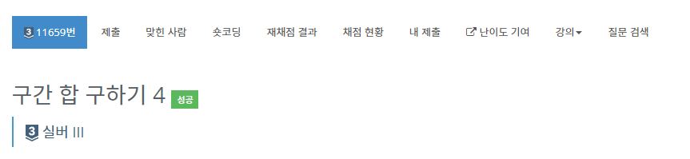

# 구간 합 구하기 4 - 11659

## 문제

수 N개가 주어졌을 때, i번째 수부터 j번째 수까지 합을 구하는 프로그램을 작성하시오.

## 입력

첫째 줄에 수의 개수 N과 합을 구해야 하는 횟수 M이 주어진다. 둘째 줄에는 N개의 수가 주어진다. 수는 1,000보다 작거나 같은 자연수이다. 셋째 줄부터 M개의 줄에는 합을 구해야 하는 구간 i와 j가 주어진다.

## 출력

총 M개의 줄에 입력으로 주어진 i번째 수부터 j번째 수까지 합을 출력한다.

## 제한

- 1 ≤ N ≤ 100,000
- 1 ≤ M ≤ 100,000
- 1 ≤ i ≤ j ≤ N

## 문제 풀이

이 문제는 prefix sum이라는 테크닉을 사용한다. 우선, 사용하지 않을 경우의 시간복잡도를 확인하자.

- M * N = 10,000,000,000

100억이니 단순하게 for문을 쓰면 문제를 풀 수 없다. 하지만 다음의 식을 이용하면 D 테이블 전체를 O(N)에 채울 수 있다.

D[i] = D[i-1] + A[i]

I 부터 J까지의 합 : 
- A[i] + A[i+1]... A[j] 이 식은
- D[j] - D[i-1] 이 식과 같다.

이 테이블을 이용하면 i,j 구간의 합은 D[j] - D[i-1]이 되어 O(1)에 계산할 수 있다.

## 풀면서 틀린 점

오랜만에 Buffered Writer를 사용하니 헷갈렸다.
정수 출력시엔 오류가 생긴다. 그 이유는 char형으로 인식하기 때문이다.
String형으로 바꿔주자.

