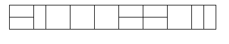

# 2 * n 타일링 2 - 11727

## 문제

2×n 직사각형을 1×2, 2×1과 2×2 타일로 채우는 방법의 수를 구하는 프로그램을 작성하시오.

아래 그림은 2×17 직사각형을 채운 한가지 예이다.

## 입력

첫째 줄에 n이 주어진다. (1 ≤ n ≤ 1,000)

## 출력

첫째 줄에 2×n 크기의 직사각형을 채우는 방법의 수를 10,007로 나눈 나머지를 출력한다.

## 문제 풀이

### 1. 테이블 정의

- D[i] = 2 * i 크기의 직사각형을 채우는 방법의 수

### 2. 점화식

- D[i] = D[i-1] + D[i-2] + i-1

### 3. 초기값

- D[1] = 1
- D[2] = 3

