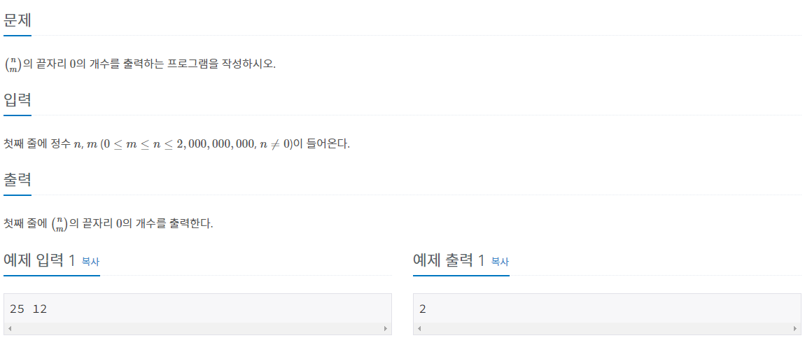

# 조합 0의 개수 - 2004번

## 문제 풀이

범위를 조심하자. 입력숫자의 범위가 20억인데, 조합의 경우의수는 매우 크다.
int가 아닌 long자료형을 사용하자.

1. nCr = n! - r!(n-r)!
2. 위의 공식을 참고하여 0의 갯수를 구하자.
3. 분자의 0의 갯수 - 분자의 0의갯수가 답이다.
4. 주의해야 할 점은, 그냥 팩토리얼 연산에서 0의 갯수는 5의 갯수를 구하면 됐지만 조합 연산의 경우 2의 갯수가 5의 갯수보다 적을 수 있기에 두 가지 경우의 수를 모두 고려하자.

