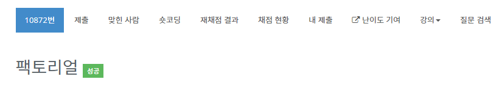

# 팩토리얼 - 10872

## 문제

0보다 크거나 같은 정수 N이 주어진다. 이때, N!을 출력하는 프로그램을 작성하시오.

## 입력

첫째 줄에 정수 N(0 ≤ N ≤ 12)이 주어진다.

## 출력

첫째 줄에 N!을 출력한다.

## 문제 풀이

1. scanner를 사용해 n을 만든다.
2. 12!는 int의 범위를 넘어가지 않으므로 간단하게 반복문으로 출력한다.
3. 0일경우 1을 출력한다.

