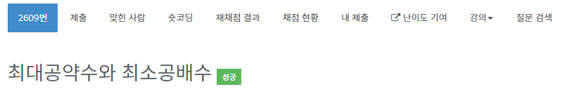

# 최대공약수와 최소공배수 - 2609

## 문제

두 개의 자연수를 입력받아 최대 공약수와 최소 공배수를 출력하는 프로그램을 작성하시오.

## 입력

첫째 줄에는 두 개의 자연수가 주어진다. 이 둘은 10,000이하의 자연수이며 사이에 한 칸의 공백이 주어진다.

## 출력

첫째 줄에는 입력으로 주어진 두 수의 최대공약수를, 둘째 줄에는 입력으로 주어진 두 수의 최소 공배수를 출력한다.

## 풀이

1. 최소공배수는 A * B / 최대공약수와 같다.
2. 최대공약수는 수를 구하는 방법은 두 가지가 있다. 하나는 일일이 나누는 것. 다른 하나는 유클리드 호제법을 이용하는 법이다.
3. 첫 번째 방법은 시간복잡도가 O(n), 두 번째 방법은 시간복잡도가 O(log N) 이다.
4. 유클리드 호재법을 이용하면 최대공약수는 A % B의 결과를 r이라 할 때 GCD(A,B) 와 GCD*(B.r)과 같다.
5. 재귀함수를 이용하면 간단하게 구할 수 있다.

    public static int gcd (int a, int b) {
        if (b == 0) {
            return a;
        } else {
            return gcd (b, a%b);
        }
    }

