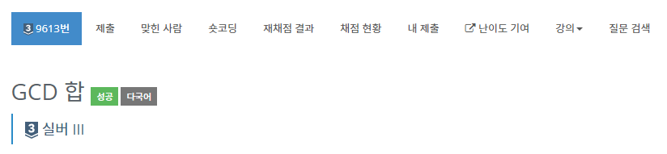

# GCD 합 -9613

## 문제

양의 정수 n개가 주어졌을 때, 가능한 모든 쌍의 GCD의 합을 구하는 프로그램을 작성하시오.

## 입력

첫째 줄에 테스트 케이스의 개수 t (1 ≤ t ≤ 100)이 주어진다. 각 테스트 케이스는 한 줄로 이루어져 있다. 각 테스트 케이스는 수의 개수 n (1 < n ≤ 100)가 주어지고, 다음에는 n개의 수가 주어진다. 입력으로 주어지는 수는 1,000,000을 넘지 않는다.

## 출력

각 테스트 케이스마다 가능한 모든 쌍의 GCD의 합을 출력한다.

## 문제풀이

1. 유클리드 호재법을 사용하여 GCD를 구하는 메서드를 만든다.
2. 유클리드 호재법: a,b의 최대공약수는 b,a%b의 최대공약수와 같다.
3. 한 줄에 테스트 케이스의 개수와 n개의 수가 주어진다. BufferedReader로 읽어 n의 길이를 갖는 배열을 만든 뒤 값을 넣어주자.
4. 위에서 만들어 놓은 GCD메서드를 사용하여 최대공약수의 합을 구한다.
5. 최대공약수 쌍은 이중 for문을 이용한다. 
6. 여기서 함정이 있다. 변수 ans는 int 자료형의 범위를 초과한다. why?
7. 입력으로 주어지는 수: 100만, 반복은 n(n+1)/2 = 최대 5050. 즉 20억을 넘을 수가 있다.

시간복잡도 : O(n^3)(log n) - for문 3개 * gcd 연산. 

