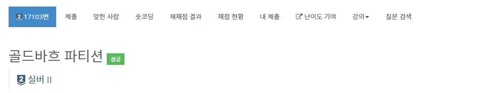

# 골드바흐 파티션 - 17103번

## 문제

- 골드바흐의 추측: 2보다 큰 짝수는 두 소수의 합으로 나타낼 수 있다.

짝수 N을 두 소수의 합으로 나타내는 표현을 골드바흐 파티션이라고 한다. 짝수 N이 주어졌을 때, 골드바흐 파티션의 개수를 구해보자. 두 소수의 순서만 다른 것은 같은 파티션이다.

## 입력

첫째 줄에 테스트 케이스의 개수 T (1 ≤ T ≤ 100)가 주어진다. 각 테스트 케이스는 한 줄로 이루어져 있고, 정수 N은 짝수이고, 2 < N ≤ 1,000,000을 만족한다.

## 출력

각각의 테스트 케이스마다 골드바흐 파티션의 수를 출력한다.

## 문제 풀이

합성수 n이 있다.
1부터 루트 n까지 나눠지지 않으면 n은 소수이다. 

- 에라토스테네스의 채를 쓴다면, log n 이상의 범위로 가면 아무것도 바꾸지 않는다.
- 그런데 이 문제는 모든 소수를 prime이라는 배열에 넣어야 한다.
- 그렇기에 i * i 가 아니라 i < n 을 사용해야 한다.
- 이것이 그냥 골드바흐의 추측과의 차이점이다.

