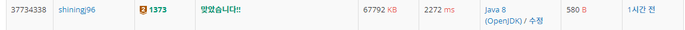

# 2진수 8진수 - 1373

## 문제

2진수가 주어졌을 때, 8진수로 변환하는 프로그램을 작성하시오.

## 입력

첫째 줄에 2진수가 주어진다. 주어지는 수의 길이는 1,000,000을 넘지 않는다.

## 출력

첫째 줄에 주어진 수를 8진수로 변환하여 출력한다.

## 플이

입력 조건을 살펴보자. 자릿수가 무려 백만이다. 즉, 숫자 자료형을 직접 사용하면 오버플로우가 일어나기에 문자 자료형을 사용해야 할 것이다.

1. 2진수를 8진수로 만드는 것이기에 3자리씩 묶어서 변환한다.
2. char 자료형을 int로 바꾸기 위해 '0'을 빼준다.
3. 자릿수가 상당히 크니 BufferedWriter을 사용해 한번에 출력하자.

#### 반복문으로 print를 반복했을 때 걸린 시간
[소스코드](./Main_slow.java)

#### BufferedWriter을 사용했을때 걸린 시간
[소스코드](./Main.java)

시간이 거의 4배 가까이 줄어든것을 볼 수 있다.

**주의**: BufferedWriter는 String만 사용할 수 있으므로 toString을 통해 형변환을 해주자.

#### BufferedWriter 추가

기존의 소스코드이다.

    public class Main {
    public static void main(String[] args) throws IOException {
        Scanner sc = new Scanner(System.in);
        String s = sc.nextLine();
        int n = s.length();
        BufferedWriter bw = new BufferedWriter(new OutputStreamWriter(System.out));
        if (n % 3 == 1) {
            bw.write(Integer.toString(s.charAt(0) - '0'));
        } else if (n % 3 == 2) {
            bw.write(Integer.toString((s.charAt(0) - '0') * 2 + (s.charAt(1) - '0')));
        }
        for (int i = n % 3; i < n; i += 3) {
            bw.write(Integer.toString((s.charAt(i) - '0') * 4 + (s.charAt(i+1) - '0') * 2 + (s.charAt(i+2) - '0')));
        }
        bw.flush();
        bw.close();
    }
}

BufferedWriter 에서 int 하나만 사용할 경우 char의 아스키코드 형식으로 변환된다는것을 알았다.
 그래서 위와 같이 toString으로 변환했는데, 다음의 방법도 사용할 수 있다.

다른 방법

    public class MainTwo {
    public static void main(String[] args) throws IOException {
        Scanner sc = new Scanner(System.in);
        String s = sc.nextLine();
        int n = s.length();
        BufferedWriter bw = new BufferedWriter(new OutputStreamWriter(System.out));
        if (n % 3 == 1) {
            bw.write((s.charAt(0) - '0')+"");
        } else if (n % 3 == 2) {
            bw.write((s.charAt(0) - '0') * 2 + (s.charAt(1) - '0')+"");
        }
        for (int i = n % 3; i < n; i += 3) {
            bw.write((s.charAt(i) - '0') * 4 + (s.charAt(i+1) - '0') * 2 + (s.charAt(i+2) - '0')+"");
        }
        bw.flush();
        bw.close();
    }
    }

보다시피 끝에 +""를 추가하면 int형이 아닌 string형으로 바뀌면서 따로 변환하지 않아도 출력시 오류가 생기지 않는다. 다만, 이 경우 시간이 조금 더 오래걸린다.

