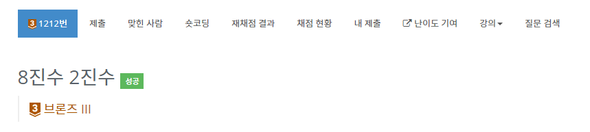

# 8진수 2진수 -1212번

## 문제

8진수가 주어졌을 때, 2진수로 변환하는 프로그램을 작성하시오.

## 입력

첫째 줄에 8진수가 주어진다. 주어지는 수의 길이는 333,334을 넘지 않는다.

## 출력

첫째 줄에 주어진 수를 2진수로 변환하여 출력한다. 수가 0인 경우를 제외하고는 반드시 1로 시작해야 한다.

## 문제풀이

자릿수가 30만자리가 넘어간다. 이 문제는 String을 써서 풀어야 한다.

1. 입력받은 문자열의 길이를 구한다.
2. 케이스를 두 개로 나눈다. 
3. 첫 번째. 인덱스가 0일 경우 숫자의 범위를 2 미만, 4미만, else로 나눈다.
4. 두 번째. 인덱스가 1부터 n-1까지의 경우. 2미만의 경우 앞에 00을 붙인다. 4미만인 경우 앞에 0을 붙인다.
5. StringBuilder로 묶어서 한번에 출력한다.

