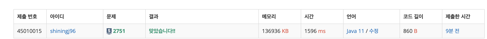
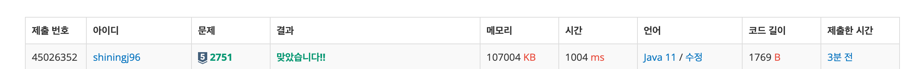

# 수 정렬하기2 -2751번

## 문제
N개의 수가 주어졌을 때, 이를 오름차순으로 정렬하는 프로그램을 작성하시오.

## 입력
첫째 줄에 수의 개수 N(1 ≤ N ≤ 1,000,000)이 주어진다. 둘째 줄부터 N개의 줄에는 수가 주어진다. 이 수는 절댓값이 1,000,000보다 작거나 같은 정수이다. 수는 중복되지 않는다.

## 출력
첫째 줄부터 N개의 줄에 오름차순으로 정렬한 결과를 한 줄에 하나씩 출력한다.

## 풀이

시간복잡도를 계산해보자.
n이 100만이니 nlogn의 시간복잡도이면 통과한다.

자바에서 제공하는 sort 기능과, 내가 직접 구현한 sort 알고리즘을 사용하여 걸린 시간을 비교해보자.

- Collection.sort

- 내가 구현한 ShellSort

Collection.Sort와 비교하여 무려 50%의 성능 차이가 난다.