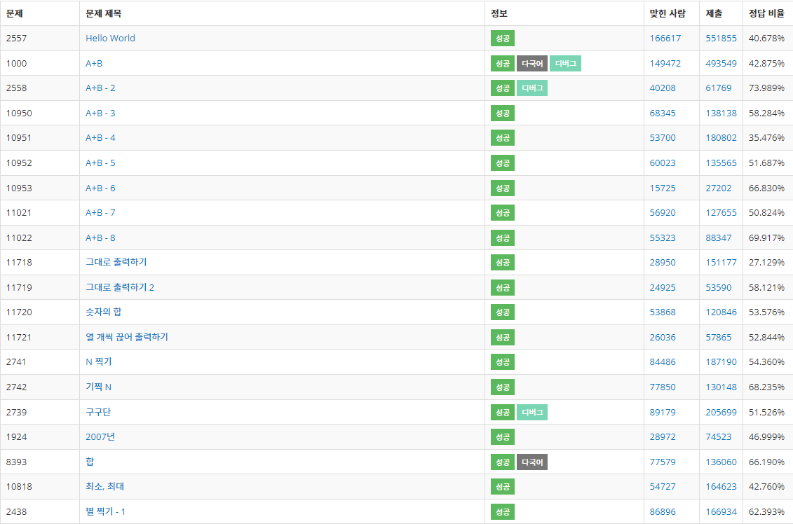
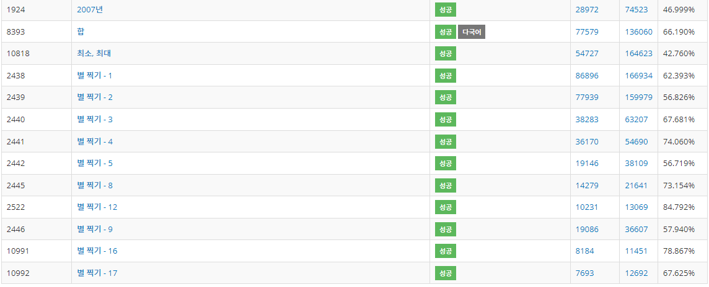

# 구현

이곳은 PS에서 쓰이는 입출력에 관해 모아놓은 문서입니다.

## 개념

### 입력

- Scanner
- BufferedReader

반복작업의 경우 Scanner클래스보다 훨씬 빠르다.

BufferedReader.readLine() : 한 줄을 읽는다.

BufferedReader.read() : 스트림의 문자 "하나"를 유니코드형식으로 읽어 반환함.

### 출력

- System.out
- bufferedWriter
- StringBuilder
- StringTokenizer

String : immutable 객체이다. 즉, str1 + str2의 경우 메모리 할당 + 해제를 통해 새로운 String객체를 생성하므로 시간이 오래걸린다.

StringerBuilder : mutable 객체이다. 즉, 변경 가능하므로 속도가 빠르고 부하가 적다.

## 문제

- 2557
- 1000
- 2558
- 10950
- 10951
- 10952
- 10953
- 11021
- 11022
- 11718
- 11719
- 11720
- 11721
- 2741
- 2742
- 2739
- 1924
- 8393
- 10818
- 2438
- 2439
- 2440
- 2441
- 2442
- 2445
- 2522
- 2446
- 10991
- 10992

