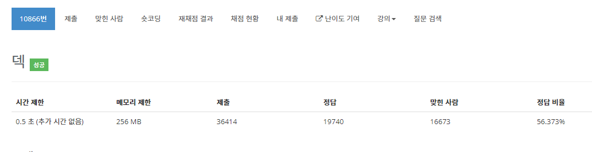

# Deque - 10866

## 문제

정수를 저장하는 덱(Deque)를 구현한 다음, 입력으로 주어지는 명령을 처리하는 프로그램을 작성하시오.

명령은 총 여덟 가지이다.

- push_front X: 정수 X를 덱의 앞에 넣는다.
- push_back X: 정수 X를 덱의 뒤에 넣는다.
- pop_front: 덱의 가장 앞에 있는 수를 빼고, 그 수를 출력한다. 만약, 덱에 들어있는 정수가 없는 경우에는 -1을 출력한다.
- pop_back: 덱의 가장 뒤에 있는 수를 빼고, 그 수를 출력한다. 만약, 덱에 들어있는 정수가 없는 경우에는 -1을 출력한다.
- size: 덱에 들어있는 정수의 개수를 출력한다.
- empty: 덱이 비어있으면 1을, 아니면 0을 출력한다.
- front: 덱의 가장 앞에 있는 정수를 출력한다. 만약 덱에 들어있는 정수가 없는 경우에는 -1을 출력한다.
- back: 덱의 가장 뒤에 있는 정수를 출력한다. 만약 덱에 들어있는 정수가 없는 경우에는 -1을 출력한다.

## 입력

첫째 줄에 주어지는 명령의 수 N (1 ≤ N ≤ 10,000)이 주어진다. 둘째 줄부터 N개의 줄에는 명령이 하나씩 주어진다. 주어지는 정수는 1보다 크거나 같고, 100,000보다 작거나 같다. 문제에 나와있지 않은 명령이 주어지는 경우는 없다.

## 출력

출력해야하는 명령이 주어질 때마다, 한 줄에 하나씩 출력한다.

---

## 문제풀이

시간복잡도: O(n) = 10000
시간제한 : 0.5초

이 문제는 시간 복잡도는 크지 않지만, 최대 1만 줄을 출력해야 하기에 System.out을 사용하면 시간제한을 초과할 위험이 있다. ArrayDeque 자료구조를 사용하여 문제를 풀 수 있다.

1. ArrayDeque 자료구조 생성
2. 반복문 생성
3. switch - case문으로 분리
4. push일 경우 st.nextToken()으로 자료 넣기 + count++ 해주기
5. 나머지는 자료를 빼는 경우 count-- 해주며 StringBuilder 객체에 숫자 넣어주기
6. 반복문이 끝나면 StringBuilder 한번에 출력

