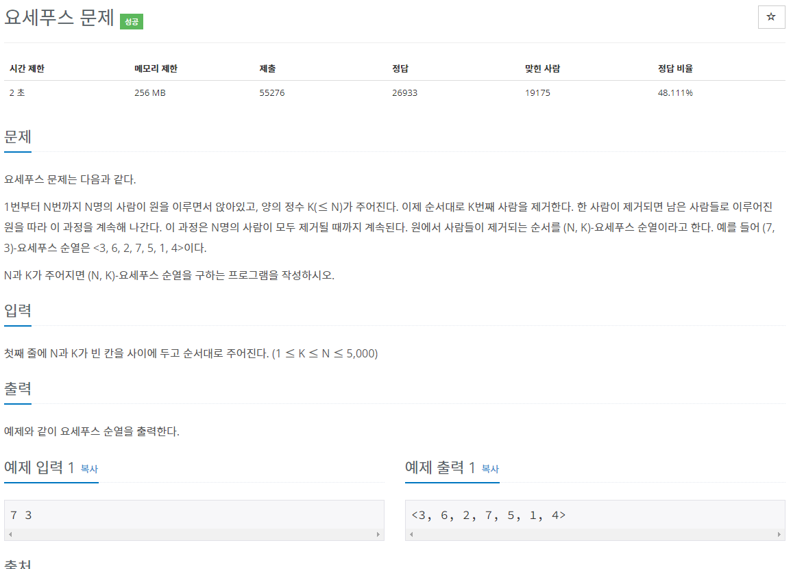

# 요세푸스 - 1158번

## 문제

## 코드

    import java.util.*;

    public class Main {
        public static void main(String[] args) {
            Scanner sc = new Scanner(System.in);
            int n = sc.nextInt();
            int k = sc.nextInt();
            Queue<Integer> queue = new LinkedList<Integer>();
            StringBuilder sb = new StringBuilder();
            sb.append("<");

            for(int i = 1; i <= n; i ++) {
                queue.offer(i);
            }

            for(int i = 0; i < n-1; i ++) {
                for(int j = 0; j < k-1; j ++) {
                    queue.offer(queue.poll());
                }
                sb.append(queue.poll() + ", ");
            }

            sb.append(queue.poll() + ">");

            System.out.println(sb);

        }
    }

## 풀이

요세푸스 문제를 큐 자료구조로 풀었다.
풀이과정은 다음과 같다.

1. 큐 자료구조 생성
2. 큐의 맨 앞에서 poll로 자료를 꺼내고, 꺼낸 자료를 offer로 맨 뒤에 넣는다.
3. StringBuilder 객체에 ", " 을 추가한다.
4. 마지막으로 poll로 자료를 꺼내준 뒤 ">" 를 붙인다.
5. 출력